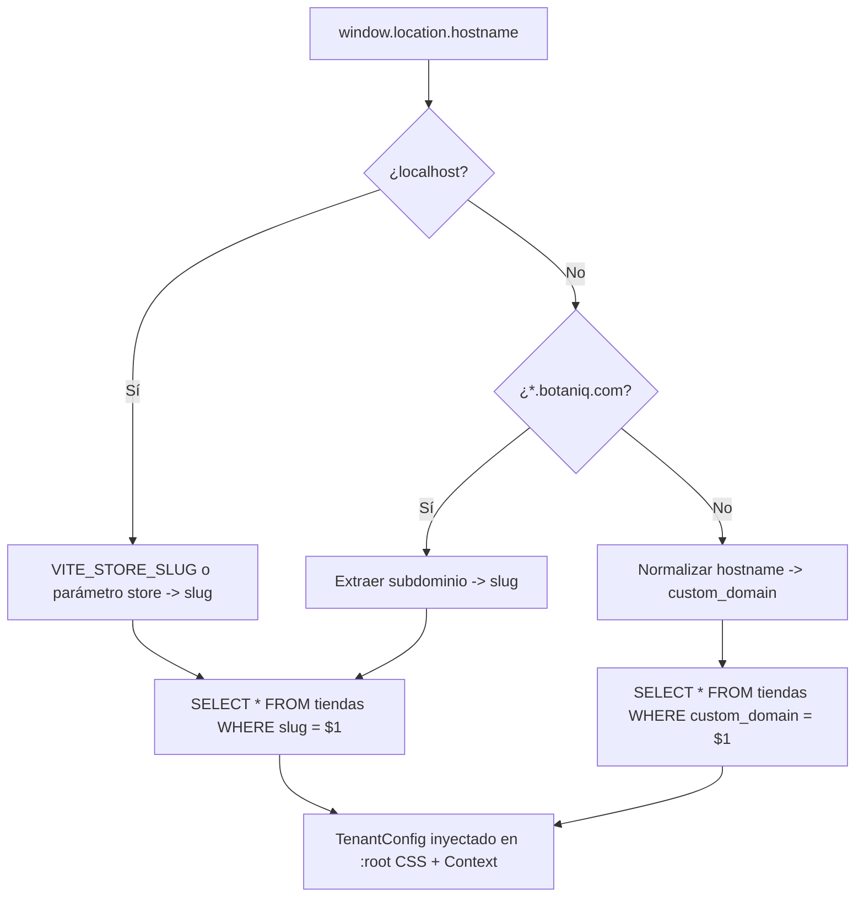
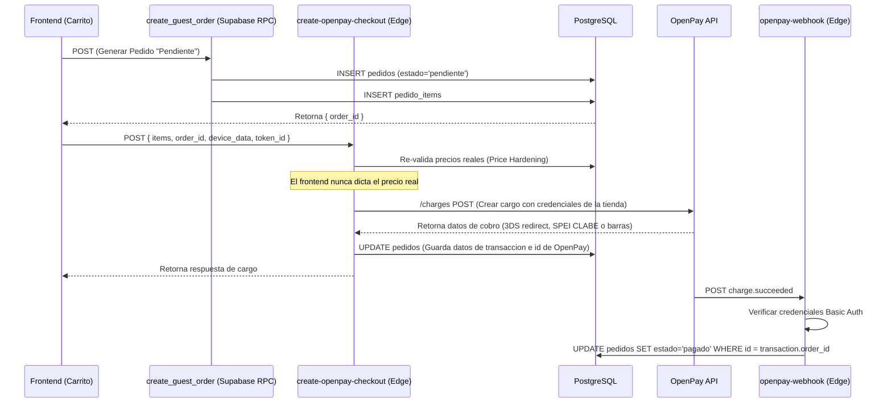
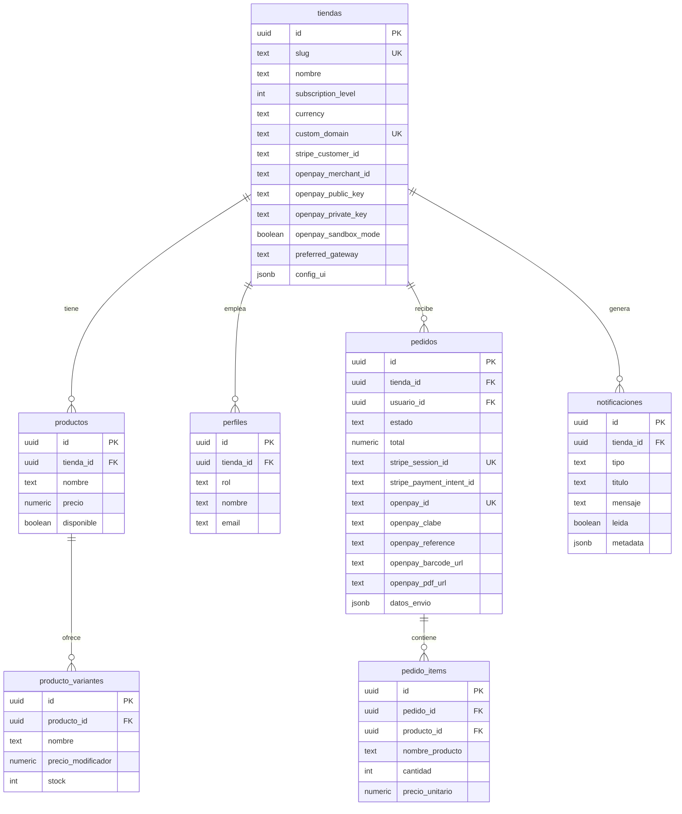

<div align="center">

# BotaniQ

### Plataforma SaaS Multi-Tenant para Negocios Locales


**Solución turnkey que transforma cualquier negocio local en un e-commerce profesional en minutos.**
Una base de código. Infinitos tenants. Tres niveles de monetización.

[Arquitectura](#arquitectura-tecnologica) · [Seguridad](#seguridad-y-core-logic-deep-dive) · [Base de Datos](#esquema-de-base-de-datos) · [Inicio Rápido](#guia-de-inicio-rapido) · [Roadmap](#roadmap-de-desarrollo)

</div>

---

## Propuesta de Valor y Modelo de Negocio

BotaniQ es una **plataforma SaaS (Software as a Service)** diseñada para que negocios locales — con foco inicial en **florerías** — tengan presencia digital profesional sin necesidad de conocimientos técnicos. Un solo despliegue sirve a múltiples clientes (tiendas) de forma aislada y segura.

### El Problema

Los negocios locales necesitan vender en línea, pero las soluciones existentes son genéricas, costosas, o requieren un equipo de desarrollo dedicado. Un dueño de florería no debería necesitar entender Stripe, OpenPay, SSL, o PostgreSQL para recibir pagos con tarjeta.

### La Solución

Una plataforma **Netflix-style**: el dueño se registra, elige su plan, personaliza su tienda desde un panel visual, y empieza a vender. Todo el backend, pagos, seguridad y logística están resueltos.

### Modelo de 3 Niveles de Suscripción

El modelo de monetización se basa en **feature gating progresivo** controlado por la columna `tiendas.subscription_level`:

| | Nivel 1 — **Básico** | Nivel 2 — **Profesional** | Nivel 3 — **Premium** |
|---|---|---|---|
| **Landing Page** | Activo: Personalizable | Activo: Personalizable | Activo: Personalizable |
| **Catálogo** | Activo: Productos + Variantes | Activo: Productos + Variantes | Activo: Productos + Variantes |
| **Panel Admin** | Activo: Dashboard + KPIs | Activo: Dashboard + KPIs | Activo: Dashboard + KPIs |
| **Gestión Pedidos** | Activo: Timeline completo | Activo: Timeline completo | Activo: Timeline completo |
| **Ventas** | WhatsApp (Manual) | Pasarelas de Pago (Stripe / OpenPay) | Pasarelas de Pago (Stripe / OpenPay) |
| **Cuentas Cliente** | Inactivo | Activo: Login + Historial | Activo: Login + Historial |
| **Notificaciones RT** | Inactivo | Activo: Realtime al Dashboard | Activo: Realtime al Dashboard |
| **Dominio Custom** | Inactivo | Inactivo | Activo: `www.mifloreria.com` |
| **Logística** | Inactivo | Inactivo | Activo: App Repartidores + GPS |

El gating se implementa con el componente declarativo `<FeatureGate>`:

```tsx
<FeatureGate requiredLevel={2} fallback={<UpgradeBanner />}>
  <OpenpayPaymentButton />
</FeatureGate>
```

---

## Arquitectura Tecnológica

### Stack Completo

```
┌─────────────────────────────────────────────────────────────────┐
│                        FRONTEND                                 │
│  React 18 · Vite 6 · Tailwind CSS v4 · Framer Motion           │
│  Zustand (Cart) · Context API (Auth + Tenant) · Lucide Icons   │
├─────────────────────────────────────────────────────────────────┤
│                     EDGE COMPUTING                              │
│  Supabase Edge Functions (Deno Deploy)                          │
│  ┌──────────────────────┐  ┌──────────────────────────────┐    │
│  │ create-openpay-      │  │ openpay-webhook              │    │
│  │ checkout             │  │ (Zero-Trust / verify_jwt=off)│    │
│  │ (3DS, SPEI, Paynet)  │  │ (Basic Auth Verification)    │    │
│  └──────────────────────┘  └──────────────────────────────┘    │
│  ┌──────────────────────┐  ┌──────────────────────────────┐    │
│  │ create-checkout-     │  │ stripe-webhook               │    │
│  │ session (Stripe)     │  │ (HMAC-SHA256 Verification)   │    │
│  └──────────────────────┘  └──────────────────────────────┘    │
├─────────────────────────────────────────────────────────────────┤
│                     BACKEND (BaaS)                              │
│  Supabase · PostgreSQL 17 · Row Level Security (RLS)            │
│  Auth (JWT + RBAC) · Realtime (WebSocket) · Storage (S3)        │
├─────────────────────────────────────────────────────────────────┤
│                       PAGOS                                     │
│  OpenPay (Recomendado LATAM - Tarjeta/SPEI/Paynet)              │
│  Stripe Checkout (Hosted - Internacional)                       │
└─────────────────────────────────────────────────────────────────┘
```

### Resolución Multi-Tenant (Dominios)

El `TenantContext` resuelve la identidad de la tienda dinámicamente según el hostname:



### Estructura del Proyecto

```
BotaniQ/
├── src/
│   ├── components/
│   │   ├── FeatureGate.tsx          # Control de acceso por nivel SaaS
│   │   ├── auth/                    # RoleProtectedRoute, LoginForm
│   │   ├── sections/                # Hero, Catálogo, Testimonios...
│   │   └── ui/                      # Componentes reutilizables (CartDrawer, BottomSheet...)
│   ├── context/
│   │   ├── TenantContext.tsx         # Resolución multi-tenant + temas CSS + OpenPay config
│   │   └── AuthContext.tsx           # Sesión + perfil + RBAC
│   ├── store/
│   │   └── cartStore.ts             # Zustand — carrito con variantes
│   ├── services/
│   │   ├── orderService.ts          # Gestión de pedidos e historial
│   │   └── checkoutService.ts       # Integraciones con Stripe y OpenPay
│   ├── layouts/
│   │   └── AdminLayout.tsx          # Shell del dashboard admin
│   ├── pages/
│   │   ├── admin/                   # Dashboard, Pedidos, Catálogo, Equipo, Config
│   │   │   ├── components/config/   # Pestañas lógicas (GeneralTab, CoberturaTab, HorariosTab)
│   │   ├── auth/                    # LoginPage, OnboardingPage
│   │   ├── public/                  # StorefrontPage (landing pública)
│   │   └── storefront/              # CustomerAccountPage
│   ├── lib/
│   │   ├── domain.ts                # Helpers para dominios de tiendas y redirecciones
│   │   ├── schemas.ts               # Esquemas Zod (validación de Google Maps y llaves de pago)
│   │   └── supabaseClient.js        # Singleton del cliente Supabase
│   ├── types.ts                     # Contratos TypeScript del dominio
│   └── main.jsx                     # Enrutamiento principal + Providers
├── supabase/
│   ├── functions/
│   │   ├── _shared/cors.ts          # Headers CORS compartidos
│   │   ├── create-openpay-checkout/ # Pago seguro OpenPay (Tarjetas 3DS, SPEI y Paynet)
│   │   ├── openpay-webhook/         # Webhook de procesamiento OpenPay con Basic Auth
│   │   ├── create-checkout-session/ # Sesión Stripe Checkout con Price Hardening
│   │   ├── stripe-webhook/          # Webhook Stripe con validación HMAC
│   │   └── sync-instagram/          # Cache de feed IG con validación RLS
│   ├── migrations/                  # DDL + RLS policies + Mapeos de tiendas y pedidos
│   └── config.toml                  # Edge Functions config
└── package.json
```

### Mapa de Rutas

| Ruta | Componente | Protección | Nivel |
|---|---|---|---|
| `/` | `StorefrontPage` | Pública | 1+ |
| `/login` | `LoginPage` | Pública | 1+ |
| `/mi-cuenta` | `CustomerAccountPage` | `RoleProtectedRoute` -> `cliente` | 2+ |
| `/admin` | `AdminDashboardPage` | `RoleProtectedRoute` -> `dueño, empleado, superadmin` | 1+ |
| `/admin/pedidos` | `AdminPedidos` | RBAC | 1+ |
| `/admin/catalogo` | `AdminProductos` | RBAC | 1+ |
| `/admin/equipo` | `AdminEquipo` | RBAC | 1+ |
| `/admin/ajustes` | `AdminConfiguracion` | RBAC | 1+ |

---

## Seguridad y Core Logic (Deep Dive)

### 1. Protocolo Zero-Trust en Edge Functions

Las Edge Functions operan bajo el principio de **"nunca confíes, siempre verifica"**:

| Función | Autenticación | Razón |
|---|---|---|
| `create-openpay-checkout` | JWT / Anon Key | Invocada por el navegador del cliente con validación CORS de origen |
| `openpay-webhook` | Basic Auth | Invocada por OpenPay utilizando credenciales de usuario/contraseña seguras |
| `create-checkout-session` | JWT / Anon Key | Invocada por el navegador para cobros internacionales con Stripe |
| `stripe-webhook` | HMAC-SHA256 | Invocada por Stripe con firma de secreto webhook |

### 2. Integración de OpenPay y Prevención de Fraudes

Para el procesamiento local en México, se implementó OpenPay con las siguientes capas de seguridad y lógica de negocio:
* **Tokenización en Cliente:** Los datos de tarjeta nunca tocan los servidores de la plataforma. El storefront utiliza el SDK de OpenPay para intercambiar datos de tarjeta por un token seguro (`token_id`).
* **Telemetría Antifraude:** Integración obligatoria de `openpay-data.v1.min.js` para generar el identificador de sesión del dispositivo (`device_data`), que se envía a la Edge Function junto al token.
* **Flujos de Pago Múltiples:**
  1. *Tarjetas con 3D Secure:* La Edge Function requiere autenticación 3DS para cargos con tarjeta, devolviendo una URL de redirección segura de BBVA/OpenPay.
  2. *Transferencias SPEI (STP):* Genera de forma asíncrona los datos de transferencia (Banco, CLABE interbancaria, Referencia) que se muestran directamente en el catálogo al cliente final.
  3. *Pagos en Efectivo (Paynet):* Genera un código de barras y referencia de pago que permite al cliente pagar en tiendas afiliadas (7-Eleven, Farmacias del Ahorro, K, OXXO, etc.).
* **Basic Auth en Webhooks:** El webhook de OpenPay (`openpay-webhook`) se protege opcionalmente con Basic Access Authentication para verificar la legitimidad de las llamadas de webhook que notifican transacciones aprobadas (`charge.succeeded`) o fallidas (`charge.failed`).

### 3. Price Hardening y Patrón "Order-First" (Transacciones Atómicas)

El sistema de pagos de BotaniQ utiliza un patrón **Order-First** para garantizar trazabilidad absoluta y evitar la pérdida de pedidos pagados (race conditions) o el descarte de clientes en Guest Checkout.



**Ventajas del patrón Order-First:**
* **Recuperación de Carritos:** Si el cliente cierra Stripe u OpenPay sin pagar, el pedido queda registrado como "pendiente" para futuras estrategias de remarketing.
* **Seguridad (Price Hardening):** El backend extrae los precios directamente de la base de datos para la pasarela de pagos.
* **Idempotencia Transaccional:** El Webhook actualiza un pedido existente mediante su UUID en lugar de crear uno nuevo de cero, eliminando problemas de duplicidad o pérdida de metadata de envío si la pasarela falla momentáneamente.

### 4. Sistema de Diseño: Pestañas de Configuración Premium

Toda la plataforma se rige bajo un sistema de diseño unificado, moderno e inmersivo. El panel de configuración de tienda está segmentado en tres pestañas lógicas:
* **Identidad y SEO:** Administra logotipo, colores de marca, tipografías, historia sobre nosotros, perfiles de redes sociales y WhatsApp.
* **Cobertura y Envíos:** Define la ubicación principal del comercio, coordenadas de Google Maps y zonas de cobertura con tarifas diferenciadas.
* **Horarios y Pagos:** Configura horarios de atención y el control de pasarelas de pago para habilitar OpenPay o Stripe Connect de forma transparente.

---

## Esquema de Base de Datos

### Tablas Principales y Relaciones



### Row Level Security (RLS)

Todas las tablas tienen RLS habilitado. El aislamiento multi-tenant es obligatorio a nivel de base de datos:

| Tabla | Política | Descripción |
|---|---|---|
| `tiendas` | `anon_read` | Lectura pública (resolver slug -> id) |
| `productos` | `anon_read` | Solo productos con `disponible = true` |
| `pedidos` | `staff_read` | Staff solo ve pedidos de su `tienda_id` |
| `pedidos` | `owner_update` | Solo dueños actualizan estado |
| `pedido_items` | `staff_read` | Acceso vía JOIN con pedidos de su tienda |
| `notificaciones` | `staff_read/update` | Staff lee y marca como leídas |

---

## Guia de Inicio Rapido

### Prerrequisitos

- Node.js 18+
- Supabase CLI v2.98+
- Cuenta de Stripe (modo test) u OpenPay (modo sandbox)

### 1. Instalación

```bash
git clone https://github.com/VSTLABOON/Landing-Base.git
cd BotaniQ
pnpm install
```

### 2. Variables de Entorno (Frontend)

```bash
cp .env.example .env
```

```env
# Supabase
VITE_SUPABASE_URL=https://tu-proyecto.supabase.co
VITE_SUPABASE_ANON_KEY=eyJ...tu-clave-anon

# Desarrollo Multi-tenant (slug de la tienda a simular)
VITE_STORE_SLUG=flores-del-corazon
```

### 3. Secretos del Servidor (Edge Functions)

```bash
# Stripe
supabase secrets set STRIPE_SECRET_KEY=sk_test_xxx
supabase secrets set STRIPE_WEBHOOK_SECRET=whsec_xxx

# OpenPay Webhook (Opcional - Credenciales Basic Auth)
supabase secrets set OPENPAY_WEBHOOK_USERNAME=mi_usuario_webhook
supabase secrets set OPENPAY_WEBHOOK_PASSWORD=mi_password_webhook
```

### 4. Ejecutar en Desarrollo

El servidor de desarrollo de Vite está configurado en el archivo `vite.config.js` para correr obligatoriamente en el **puerto 3000** (`port: 3000, strictPort: true`), esto para alinearse con los enlaces de redirección configurados en Stripe y Supabase.

```bash
# Frontend (Vite dev server corriendo en http://localhost:3000)
pnpm dev

# Edge Functions (en otra terminal)
supabase functions serve
```

### 5. Desplegar Edge Functions

```bash
# Checkout Stripe
supabase functions deploy create-checkout-session

# Webhook Stripe
supabase functions deploy stripe-webhook --no-verify-jwt

# Checkout OpenPay
supabase functions deploy create-openpay-checkout

# Webhook OpenPay
supabase functions deploy openpay-webhook --no-verify-jwt
```

---

## Roadmap de Desarrollo

### Completado

| Milestone | Componentes |
|---|---|
| **Landing Multi-tenant** | TenantContext, resolución slug/subdominio/custom_domain, temas CSS dinámicos |
| **Catálogo con Variantes** | AdminProductos, CRUD productos + variantes, imágenes Storage |
| **Panel Admin Completo** | Dashboard KPIs, Pedidos (timeline), Equipo, Store Builder |
| **Auth + RBAC** | AuthContext, RoleProtectedRoute, login universal, 5 roles |
| **Feature Gating SaaS** | FeatureGate declarativo, 3 niveles de suscripción |
| **Carrito con Zustand** | cartStore, merge de duplicados, selectores derivados |
| **Pagos Stripe (Nivel 2)** | create-checkout-session con Price Hardening |
| **Webhook Zero-Trust** | stripe-webhook con firma HMAC, idempotencia dual, notificaciones |
| **Notificaciones Realtime** | INSERT en notificaciones -> Supabase Realtime -> Dashboard |
| **Animaciones Premium** | Framer Motion: scroll-reveal, layout transitions, bottom sheet glows |
| **Superadmin: Suscripciones**| Panel en /superadmin/suscripciones para gestionar MRR y tenants |
| **UX y Seguridad** | Dark Mode nativo (Tailwind v4), Logout por inactividad (15 min) |
| **Pasarela OpenPay (Nivel 2)**| create-openpay-checkout y webhook con soporte Tarjetas, SPEI y Paynet |
| **Configuración de Pasarela**| Interfaz HorariosTab con selector y inputs de credenciales para el florista |

### En Progreso

| Feature | Detalle |
|---|---|
| **Guest Checkout Completo** | Flujo de compra sin login con datos de envío |
| **Conexión Pedidos Live** | Reemplazar mock data en AdminPedidos con queries Supabase |
| **Notificaciones en Dashboard** | Bell icon con badge + panel desplegable Realtime |

### Proximos Hitos

| Feature | Nivel | Prioridad |
|---|---|---|
| **Onboarding Self-Service** | — | Alta |
| **Stripe Connect (Split Payments)** | 2 | Media |
| **App de Repartidores** | 3 | Media |
| **Tracking GPS en Tiempo Real** | 3 | Media |
| **Analíticas Avanzadas** | 3 | Baja |
| **Internacionalización (i18n)** | — | Baja |

---

## Licencia

Proyecto propietario. Todos los derechos reservados.

---

<div align="center">

Arquitectura diseñada por el equipo de ingeniería de **BotaniQ**.

*Built for local businesses that deserve world-class technology.*

</div>
